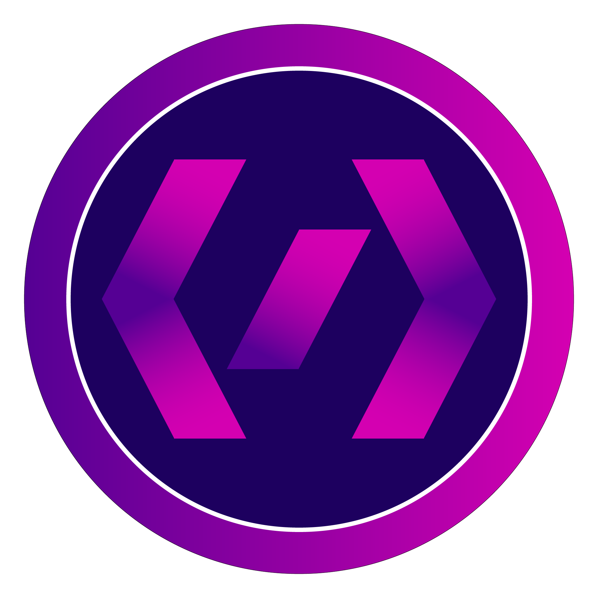

<!-- ═══════════════════════════════════════════════════════════════ -->
<!--                         CODEBUZZ PROFILE                       -->
<!-- ═══════════════════════════════════════════════════════════════ -->

<div align="center">

<h1>
  
  &nbsp;CodeBuzz
</h1>

### `SOFTWARE` • `HARDWARE` • `WEB` • `IoT`


<br>


</div>

---

<div align="center">

## `// DEVELOPER PROFILE`

</div>

```text
╭──────────────────────────────────────────────────────────────╮
│                                                              │
│  NAME       : Advait / CodeBuzz                              │
│  ROLE       : Developer • Builder • Student                  │
│                                                              │
│  HARDWARE   : Arduino • NodeMCU • Sensors • IoT              │
│  SOFTWARE   : VB.NET • Python                                │
│  WEB        : HTML • CSS • JavaScript • Firebase             │
│  DATA       : SQL                                            │
│                                                              │
│  CURRENTLY  : Re-mastering Python                            │
│  EXPLORING  : Computer Vision • Automation • Tooling         │
│                                                              │
╰──────────────────────────────────────────────────────────────╯
```

<div align="center">

## `// MY DEVELOPMENT JOURNEY`

</div>

<table align="center">
<tr>

<td align="center" width="25%">

### 🤖

**ROBOTICS**

Arduino  
NodeMCU  
Sensors  
IoT

</td>

<td align="center" width="5%">

### ➜

</td>

<td align="center" width="25%">

### 🖥️

**SOFTWARE**

VB.NET  
Desktop Apps  
Automation

</td>

<td align="center" width="5%">

### ➜

</td>

<td align="center" width="25%">

### 🌐

**WEB**

HTML  
CSS  
JavaScript  
Firebase

</td>

<td align="center" width="5%">

### ➜

</td>

<td align="center" width="25%">

### 🐍

**PYTHON**

Python  
OpenCV  
SQL  
Tooling

</td>

</tr>
</table>

---

<div align="center">

## `// TECHNOLOGY STACK`

<br>

<table align="center">

<tr>
<td colspan="6" align="center">

### `LANGUAGES`

</td>
</tr>

<tr>

<td align="center" width="110">
<br>
<sub><b>Python</b></sub>
</td>

<td align="center" width="110">
<br>
<sub><b>JavaScript</b></sub>
</td>

<td align="center" width="110">
<br>
<sub><b>HTML</b></sub>
</td>

<td align="center" width="110">
<br>
<sub><b>CSS</b></sub>
</td>

<td align="center" width="110">
<br>
<sub><b>SQL</b></sub>
</td>

<td align="center" width="110">
<br>
<sub><b>Bash</b></sub>
</td>

</tr>

<tr>
<td colspan="6" align="center">

### `HARDWARE & IoT`

</td>
</tr>

<tr>

<td align="center" width="110">
<br>
<sub><b>Arduino</b></sub>
</td>

<td align="center" width="110">
<br>
<sub><b>Firebase</b></sub>
</td>

<td align="center" width="110">
🟦<br>
<sub><b>NodeMCU</b></sub>
</td>

<td align="center" width="110">
📡<br>
<sub><b>ESP8266</b></sub>
</td>

<td align="center" width="110">
📟<br>
<sub><b>Sensors</b></sub>
</td>

<td align="center" width="110">
⚙️<br>
<sub><b>IoT</b></sub>
</td>

</tr>

<tr>
<td colspan="6" align="center">

### `TOOLS & PLATFORMS`

</td>
</tr>

<tr>

<td align="center" width="110">
<br>
<sub><b>Git</b></sub>
</td>

<td align="center" width="110">
<br>
<sub><b>GitHub</b></sub>
</td>

<td align="center" width="110">
<br>
<sub><b>VS Code</b></sub>
</td>

<td align="center" width="110">
<br>
<sub><b>Linux</b></sub>
</td>

<td align="center" width="110">
<br>
<sub><b>Firebase</b></sub>
</td>
<td align="center" width="110">
<br>
<sub><b>VB.NET</b></sub>
</td>

</tr>

</table>

</div>

---

<div align="center">

## `// SELECTED BUILDS`

</div>

<table align="center">
<tr>

<td width="50%">

### ⚡ CodeBuzz Scaffold

A Python project scaffolding tool designed to quickly create and configure new projects.

**Stack**

`Python` `CLI` `Automation` `Ruff`

</td>

<td width="50%">

### 🧾 Happy Family Invoicer

A web-based invoice application with Firebase integration and PDF generation.

**Stack**

`HTML` `CSS` `JavaScript` `Firebase`

</td>

</tr>

<tr>

<td width="50%">

### 🤖 Robotics & IoT

A collection of hardware projects involving microcontrollers, sensors and physical-world interfacing.

**Stack**

`Arduino` `NodeMCU` `ESP8266` `Sensors`

</td>

<td width="50%">

### 🖥️ VB.NET Applications

Desktop applications built while working extensively with the VB.NET ecosystem.

**Stack**

`VB.NET` `.NET` `Windows`

</td>

</tr>
</table>

---

<div align="center">

## `// CONTRIBUTION MATRIX`

<br>


</div>

---

<div align="center">

## `// ACHIEVEMENTS`

<br>


</div>

---

<div align="center">

## `// CURRENTLY BUILDING`

<table align="center">
<tr>

<td align="center" width="33%">

🐍

### PYTHON

Re-mastering Python  
Building tools & automation

</td>

<td align="center" width="33%">

👁️

### COMPUTER VISION

Exploring OpenCV  
Image processing & vision

</td>

<td align="center" width="33%">

🗄️

### DATABASES

Learning SQL  
Working with data

</td>

</tr>
</table>

</div>

---

<div align="center">

## `// SYSTEM STATUS`

<br>


<br><br>
</div>

---

<div align="center">

### `// CONNECT`

<a href="https://github.com/therealcodebuzz">

</a>

<br><br>


</div>
